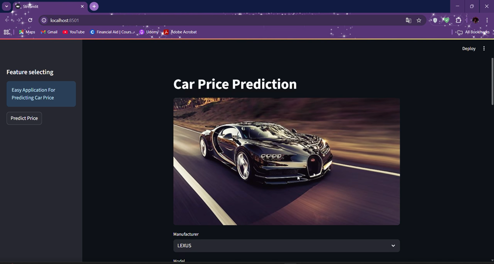

# 🚗 Car Price Prediction App
## 📸 Screenshots
Below are sample screenshots from the application:

### 🖼 Main App Interface



---

## 📌 Project Overview
This project provides an interactive **Car Price Prediction** app built with **Streamlit**, using a trained machine learning regression model to estimate the market price of a car based on its features.

The user selects car attributes such as:
- Manufacturer  
- Model  
- Category  
- Engine volume  
- Gear box type  
- Fuel type  
- Drive wheels  
- Color  
- Leather interior  
- Mileage  
- Age  
- Airbags  
- Levy  
- Cylinders  

Then the model predicts the estimated car price instantly.

---

## 📊 Dataset & Model
The machine learning model was trained on a large car dataset and saved into:

```
cars_Predictions.sav
```

The app loads the saved model and automatically handles all preprocessing and feature encoding.

---

## 🛠 Tools & Technologies
- **Python**  
- **Streamlit**  
- **Pandas**  
- **Pickle**  
- **Machine Learning Regression Model**

---

## 🚀 How the App Works
1. User selects car options from dropdown menus.  
2. Input is converted into a DataFrame.  
3. The trained model predicts the car price.  
4. The app displays the prediction with clean UI formatting.

---

## ▶️ Run the App Locally

### 1. Install Requirements
```bash
pip install streamlit pandas
```

### 2. Run the App
```bash
streamlit run app.py
```

### 3. Ensure the Model File Exists
Place the file below in the project directory:
```
cars_Predictions.sav
```

---

## 📁 Project Structure
```
├── app.py
├── cars_Predictions.sav
├── car_price_prediction.ipynb
└── README.md
```

---

## 🎯 Conclusion
This project shows how machine learning can be integrated with a modern UI to provide instant, accurate car price predictions.  
Useful for buyers, sellers, and automotive analytics.

**Smart Predictions for Smarter Decisions. 🚗💡**
